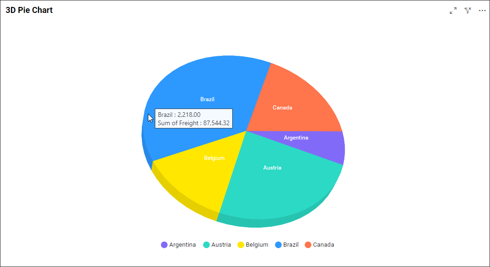
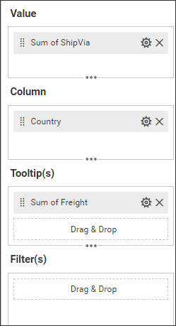
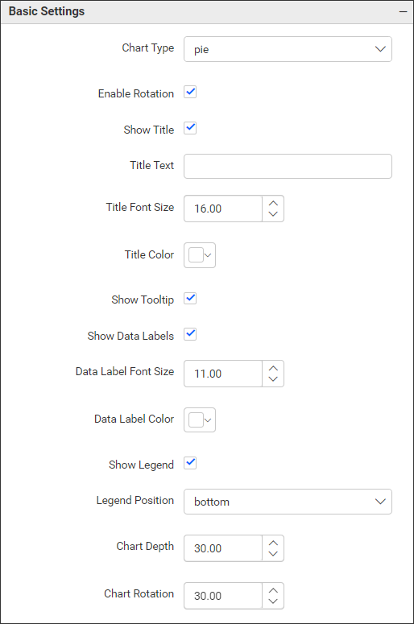
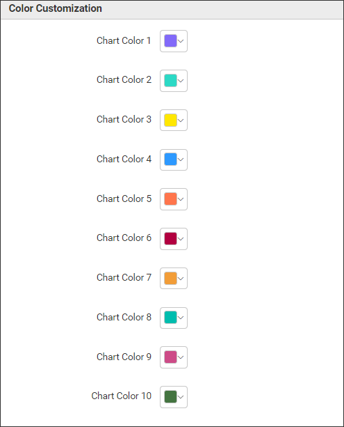
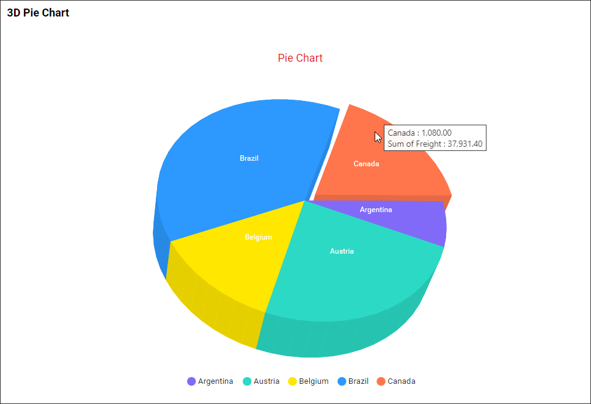

**3D Pie Chart**

This is 3D Pie Chart to visualize the data in 3D visualizations as in the below image.

**Data Binding**

You can bound the data to the widget as in the below image.

**Value**

You can add the number values to this section.

**Column**

You can add the string or date values to this section.

**Tooltip(s)**

If you want to see the addition column details in the chart tooltip then you can bind the respective columns in this section to view it in chart tooltip.

**Filter(s)**

Filters section helps us to filter out the data values passed to the chart with the use of some other columns.

**Properties**

This Properties section helps us to customize the pie chart visualization as per our need. We have the following properties to customize the 3d pie chart.

**Basic Chart Properties**

**Chart Type** property help us to change the chart type as Pie and Doughnut.

**Show Data Labels** property help us to enable/disable the data labels in the chart.

**Show Legend** property help us to enable/disable the legend in the chart.

Likewise we can customize the chart with the use of below properties.

**Color Customization**

With the use of this properties we can assign different colors to each pie chart segments as per our requirement.

**Properties Updated Image**

