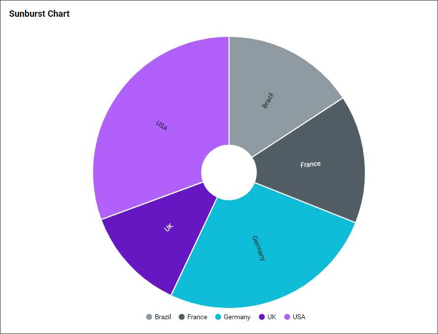
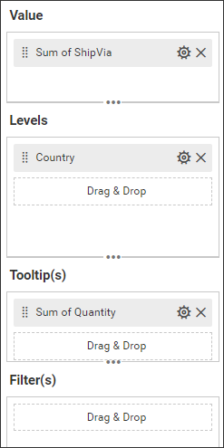
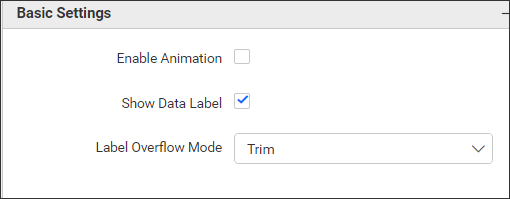
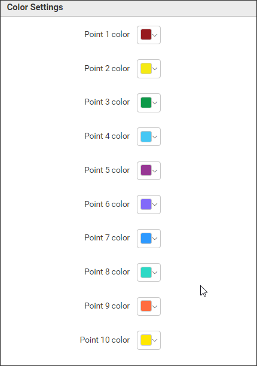
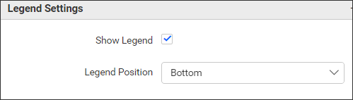
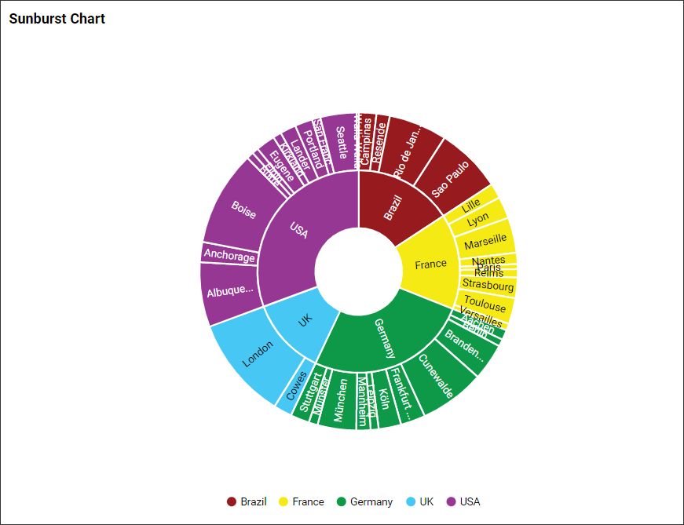

**Sunburst Chart**

This is Sunburst Chart to visualize the data as in the below image.

**Data Binding**

You can bound the data to the widget as in the below image.

**Value**

You can add the number values to this section.

**Levels**

You can add the string or date values to this section.

**Tooltip(s)**

If you want to see the addition column details in the chart tooltip then you can bind the respective columns in this section to view it in chart tooltip.

**Filter(s)**

Filters section helps us to filter out the data values passed to the Sunburst chart with the use of some other columns.

**Properties**

This Properties section helps us to customize the Sunburst chart visualization as per our need. We have the following properties to customize the Sunburst chart.

**Basic Settings**

**Enable Animation** property help us to enable/disable the animation effect to Sunburst chart.

**Show Data Labels** property help us to enable/disable the data labels in the chart.

**Label Overflow Mode** property helps to handle the x axis label, if labels overlap with another label through Hide or Trim.

**Color Settings**

With the use of this properties we can assign different colors to each sunburst chart segments as per our requirement.

**Legend Settings**

**Show Legend** property enables/disable the legend for the sunburst chart.

**Legend Position** property helps to positioning the legends as per our requirement.

**Properties Updated Widget Image**

