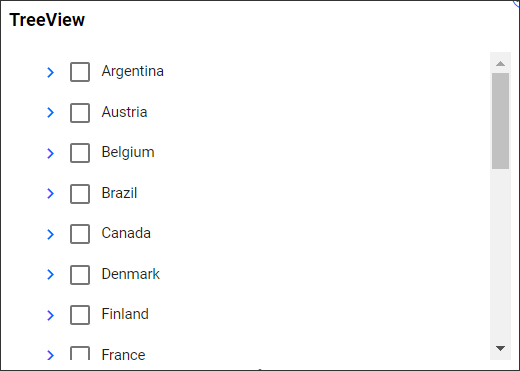
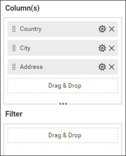
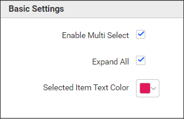
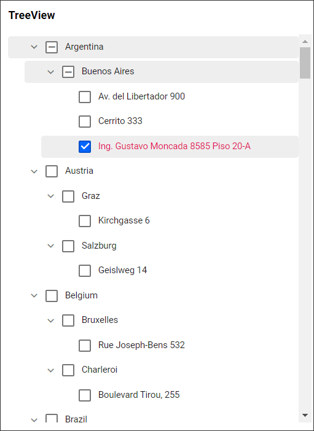

**TreeView**

This is TreeView to visualize the data as in the below image.

**Data Binding**

You can bound the data to the widget as in the below image.

**Column(s)**

You can add the string or date values to this section.

**Filter**

Filter section helps us to filter out the data values passed to the TreeView with the use of some other columns.

**Properties**

This Properties section helps us to customize the TreeView visualization as per our need. We have the following properties to customize the TreeView.

**Basic Settings**

**Enable Multi Select** property help us to enable/disable the multiselect option in TreeView.

**Expand All** property help us to enable/disable the TreeView with its child level.

**Selected Item Text Color** property help us to set the font color to the selected item in TreeView.

**Properties Updated Widget Image**

