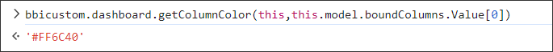

**Getting the Color Codes**

In the Bold BI application, we will generate a unique color for the columns available in the datasource. This color code will not change, even if we use the same column in multiple widgets. 

**How to Get Color Code in Custom Widget?**

To get the color code for the columns added in the custom widget, you can use the below sample code to achieve it.

```
bbicuston.dashboard.getColumnColor(customwidgetObj, columnInfo);
```

(i.e.) bbicustom.dashboard.getColumnColor(this, this.model.boundColumns.Value[0])

**Sample Image**

