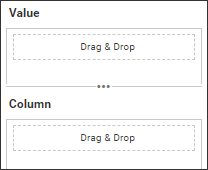

# Adding DataBinding to the Custom Widget.

Utilize data binding to define the capabilities of your custom widget. To implement data binding, make changes in the **widgetconfig.json** file.



Here's a sample schema for custom widget data binding.

```json

	"dataFields": [
		{
		  "displayName": "Value",
		  "valueType": "measure",
		  "name": "numberValues",
		  "min": "1",
		  "max": "1",
		  "optional": "false"
		},
		{
		  "displayName": "Column",
		  "valueType": "dimension",
		  "name": "stringValues",
		  "min": "1",
		  "max": "1",
		  "optional": "false"
		}
	]

```

Once you have bound data to the custom widget, the respective bound column details can be get from the custom widget model(**this.model.boundcolumns**). To obtain the data that is bound to the custom widget, you can use the custom widget model **this.model.boundcolumns.numberValues** and **this.model.boundcolumns.stringValues**.