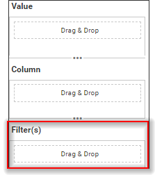

# Filters Section in Custom Widget

The custom widget includes support for a filters section, allowing you to control data passing to the widget during data binding. Similar to data binding, you can define the filters section directly in the **widgetconfig.json** file.



A sample schema for custom widget Filters section as follows.

```json

	"dataFields": [
		{
		  "displayName": "Filter(s)",
		  "valueType": "both",
		  "name": "FilterColumn",
		  "min": "1",
		  "max": "1",
		  "optional": "true"
		}
	]

```
**Note**: It is necessary to utilize the name **FilterColumn** in order to construct a Filters section.