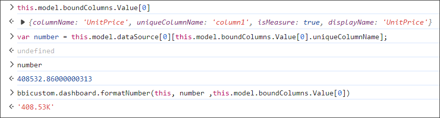

**Formatting the Number Values**

You can use number formats to change the appearance of numbers without changing the actual numerical value. The number format does not affect the actual value that the widget uses to perform calculations.

**How to Format Number Values in Custom Widget ?**

You can format the number values using the **formatNumber** method, as shown below.

```
bbicuston.dashboard.formatNumber(customwidgetObj, numberValue, columnInfo);
```

(i.e.) bbicuston.dashboard.formatNumber(this, 100000000, this.model.boundColumns.Value[0]);

**Sample Image**

