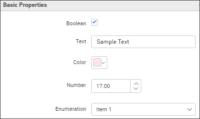

# Adding Properties to the Custom Widget.

Utilize properties to customize your custom widget based on specific requirements.

To add properties, make changes in the **widgetconfig.json** file.



A sample schema for custom widget properties as follows. Based on the need you can define number of properties and properties group inside the (**functionalities**) key as below.

```javascript

	"functionalities": [
		{
			"header": "Basic Properties",
				"properties": [
				{
				  "displayName": "Boolean",  //This section can be utilized to generate a combobox property.
				  "controlType": "bool",
				  "name": "showText",
				  "defaultValue": "true"
				},
				{
				  "displayName": "Text",  //This section can be utilized to generate a number updown property.
				  "controlType": "text",
				  "name": "text",
				  "defaultValue": "Sample Text"
				},
				{
				  "displayName": "Color",  //This section can be utilized to generate a property.
				  "controlType": "color",
				  "name": "textBackground",
				  "defaultValue": "#FFE5E5"
				},
				{
				  "displayName": "Number",  //This section can be utilized to generate a textbox property.
				  "controlType": "number",
				  "name": "textSize",
				  "defaultValue": 17,
				  "min": 0,
				  "max": 600
				},
				{
				  "displayName": "Enumeration",  //This section can be utilized to generate a checkbox property.
				  "controlType": "enumeration",
				  "name": "textStyle",
				  "defaultValue": "Item 1",
				  "listItems": [
					"Item 1",
					"Item 2"
				  ]
				}
			]
		}
	]

```
Access the custom widget property values in the custom widget model using **this.model.properties**.