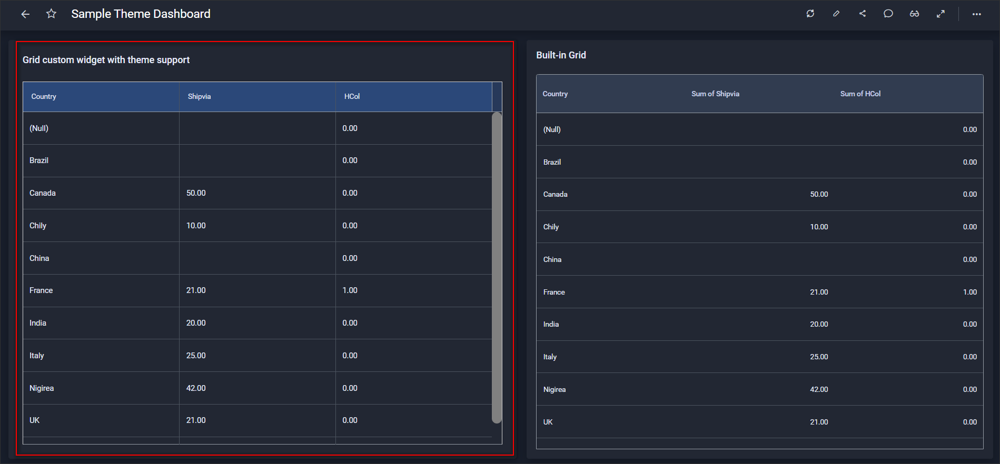
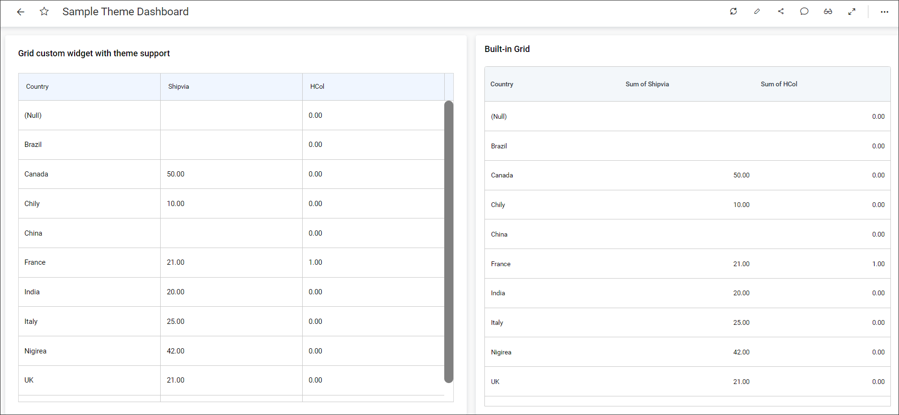

**Theming Support**

The ability to customize the visual appearance of a dashboard is achieved by defining a set of styles and formatting options. By applying a theme, you can efficiently and consistently alter the colors, fonts, and other design elements throughout different visualizations and elements within your dashboard report. This practice aids in maintaining a uniform and polished appearance for your dashboards.

**How to achieve theming in Custom widget ?**

To achieve theming in a custom widget, we have introduced some common theme variables that can be used to achieve the theming.

**Common Theme Variables**

We have pre-defined certain common theme variables that are applicable to all custom widgets as listed below.


**Bacground Color Variables**
```
--custom-widget-primary-background-color:var(--widget-primary-background);

--custom-widget-secondary-background-color:var(--secondary-background-color);

--custom-widget-selection-background-color:var(--widget-selection-background-color);

--custom-widget-hover-background-color:var(--active-bg-hover-color);
```

**Text Color Variables**
```
--custom-widget-primary-font-color:var(--widget-primary-font-color);

--custom-widget-secondary-font-color:var(--widget-secondary-font-color);

--custom-widget-selection-font-color:var(--widget-selection-font-color);

--custom-widget-hover-font-color:var(--widget-secondary-font-color);
```

**Text Style Variable**

```
--custom-widget-fontfamily:var(--designer-font);

```

The values to the variables are inheritted from the application variables to match the UI.

**Custom Theme Variables**

In some cases, if the default theme variables are not sufficient, we can add new theme variables in the custom widget file, which is available in the [Theme Studio](https://github.com/bold-bi/boldbi-themestudio/blob/Customwidget-Changes-HFv7/themes/light/widgets/boldbi.custom.widgets.definition.css) repository. We can then generate the new theme file with the new variables and replace it in the Bold BI application to achieve it.

**Applying theme variables in JS file**

You can find the sample code to know how to apply theme variables into the javascript files.

```javascript
    var widget = document.createElement("div");
	widget.style.backgroundColor = "var(--custom-widget-primary-background-color)";
```

**Applying theme variables in CSS file**

You can find the sample code to know how to apply theme variables into the styleSheet(css) files.

```stylesheet
.bbi-Custom-GGrid .e-grid .e-gridheader .e-headercontent,.bbi-Custom-GGrid .e-grid .e-gridheader {
	background: var(--custom-widget-hover-background-color);
}
.bbi-Custom-GGrid .e-grid .e-gridheader .e-headercontent .e-columnheader .e-headercell .e-headertext {
	color: var(--custom-widget-primary-font-color);
	font-family: var(--custom-widget-fontfamily);
}

.bbi-Custom-GGrid .e-grid .e-gridcontent .e-content .e-row .e-rowcell.e-selectionbackground.e-active {
	background: var(--custom-widget-selection-background-color);
	color: var(--custom-widget-selection-font-color);
}
```

**Sample Images**

Dark theme mode



Light theme mode

