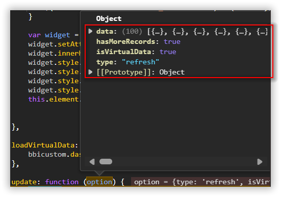

# Virtual Data Fetching 

The virtual data fetching feature provides you with the ability to significantly customize the amount of data returned by the server. However, this feature should be utilized to retrieve limited data for the client. If necessary, we can then request the server to obtain the remaining data by utilizing its page size.

You can follow the steps below to achieve virtual data fetching support in custom widgets.

**Step1:** You can enable the virtual data fetching support in custom widget with the use of enabling it in the json attributes as below.

**"enableVirtualDataLoading": true**

**"virtualDataLoadingPageSize": 100**

```json
{
  "widgetName": "DemoCustomWidget",
  "guid": "GUID",
  "displayName": "DemoCustomWidget",
  "category": "Miscellaneous",
  "description": "Sample widget for getting start",
  "srcFile": "src/sourcefile.js",
  "enableVirtualDataLoading": true,
  "virtualDataLoadingPageSize": 100
  ...
}
```
**Step2:** After enabling these JSON attributes, you will by default receive the first 100 data in the custom widget. To request the next 100 data, use the code below. Maintain the current page index details in the custom widget model as shown below.

**bbicustom.dashboard.fetchData(currentcustomwidget ,pageIndex, enableWaitingIndicator);**

**currentcustomwidget** --> Current custom widget scope it can be passed as like below.

**pageIndex** --> Index of the page to retreive its respective data.

**enableWaitingIndicator** --> This will help us to enable the loading indicator till we will fetch data from server. Also this is an optional parameter.

```javascript
	bbicustom.dashboard.fetchData(this,this.model.pageIndex++, false);
```

**Step3:** Once we have called the fetchData() method it will return the data in the update() method with data as like the below image. Also it will return two additional attributes like **hasMoreRecords** and **isVirtualData** with the use of it we can identify whether its a virtual load data or not and also we can confirm still more records available or not in the DB for the bound columns.


