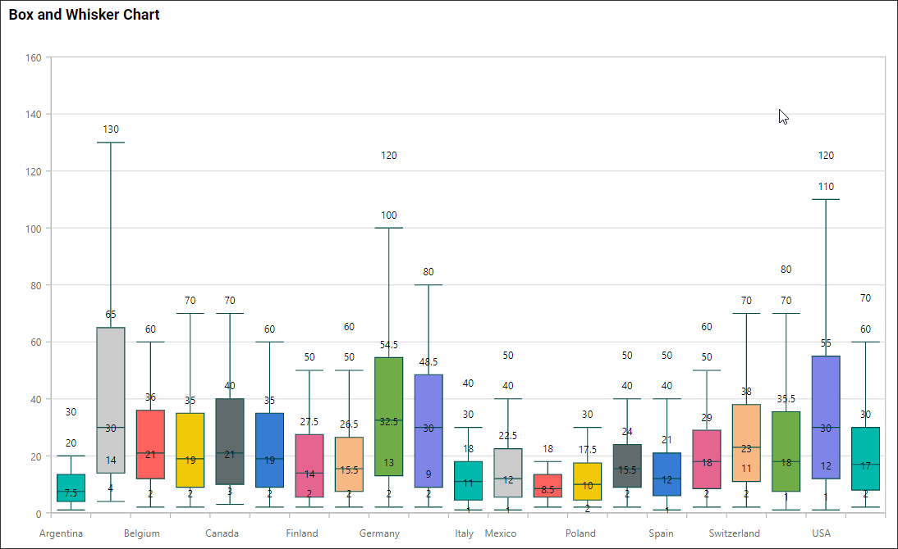
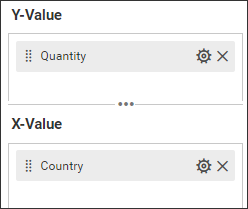
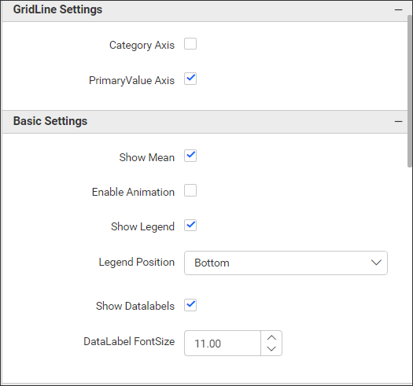
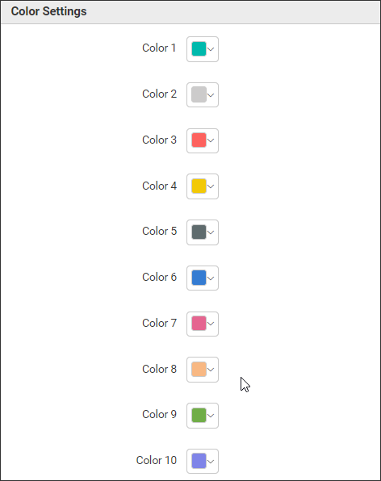
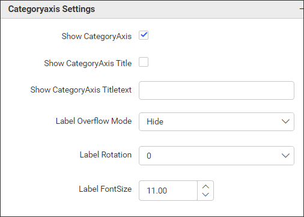
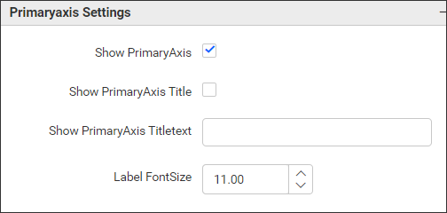
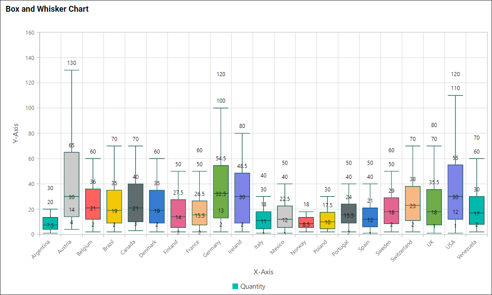

**Box and Whisker Chart**

This is Box and Whisker Chart to visualize the data as in the below image.

**Data Binding**

You can bound the data to the widget as in the below image.

**Y-Value**

You can add the number values to this section.

**X-Value**

You can add the string or date values to this section.

**Properties**

This Properties section helps us to customize the Box and Whisker chart visualization as per our need. We have the following properties to customize the Box and Whisker chart.

**GridLine Settings**

This property helps to enable/disable the gridlines of the Box and Whisker chart X and Y axis.

**Basic Settings**

**Enable Animation** property help us to enable/disable the animation effect to the Box and Whisker chart.

**Show Data Labels** property help us to enable/disable the data labels in the Box and Whisker chart.

**Show Legend** property help us to enable/disable the legend in the Box and Whisker chart.

Likewise we can customize the Box and Whisker chart with the use of below properties.

**Color Settings**

With the use of this properties we can assign different colors to each chart segments as per our requirement.

**CategoryAxis Settings**

**Show CategoryAxis** property helps to enable/disable the x axis to the chart.

**Show CategoryAxis Title** property helps to enable/disable the x axis title to the chart. And **Show CategoryAxis Titletext** property value can be displayed as a title to the x axis.

**Label Overflow Mode** property helps to handle the x axis label, if labels overlap with another label through Hide or Trim.

**Label Rotation** property helps to handle the x axis label, if labels overlap with another label through rotating the labels.

**Label FontSize** property helps to handle the x axis label font size.

**PrimaryAxis Settings**

**Show PrimaryAxis** property helps to enable/disable the y axis to the chart.

**Show PrimaryAxis Title** property helps to enable/disable the x axis title to the chart. And **Show PrimaryAxis Titletext** property value can be displayed as a title to the y axis.

**Label FontSize** property helps to handle the y axis label font size.

**Properties Updated Widget Image**

