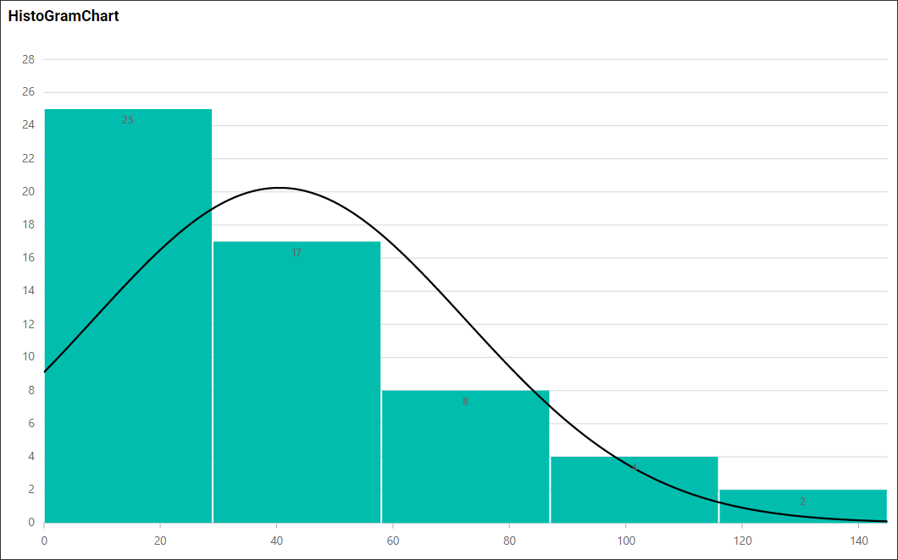
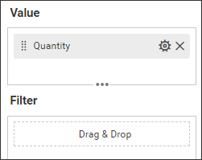
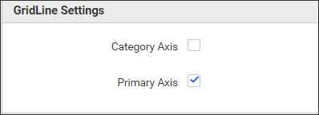
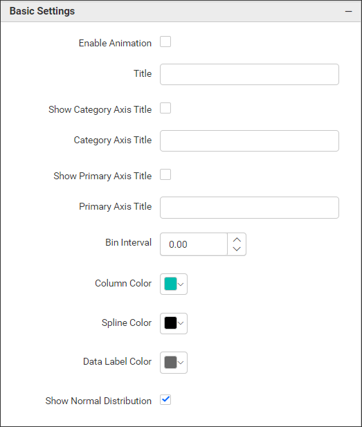
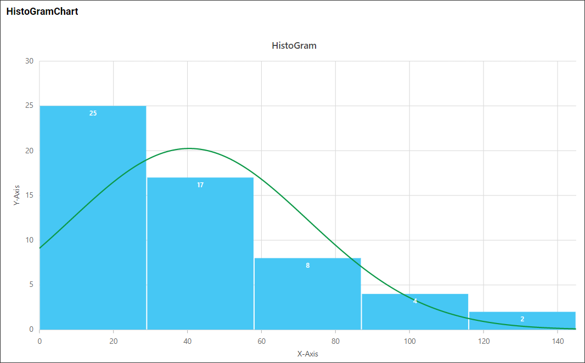

**Histogram Chart**

This is Histogram Chart to visualize the data as in the below image.

**Data Binding**

You can bound the data to the widget as in the below image.

**Value**

You can add the number values to this section.

**Filter**

Filter section helps us to filter out the data values passed to the Histogram chart with the use of some other columns.

**Properties**

This Properties section helps us to customize the Histogram chart visualization as per our need. We have the following properties to customize the Histogram chart.

**GridLine Settings**

This property helps to enable/disable the gridlines of the Histogram chart X and Y axis.

**Basic Settings**

**Enable Animation** property help us to enable/disable the animation effect to Histogram chart.

**Show Category Axis Title** property helps to enable/disable the x axis title to the chart. And **Category Axis Title** property value can be displayed as a title to the x axis.

**Show Primary Axis Title** property helps to enable/disable the y axis title to the chart. And **Primary Axis Title** property value can be displayed as a title to the y axis.

Likewise we can customize the Histogram chart with the use of below properties.

**Properties Updated Widget Image**

