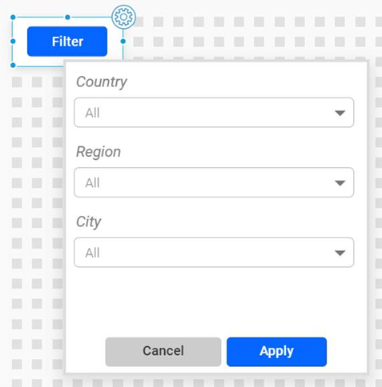
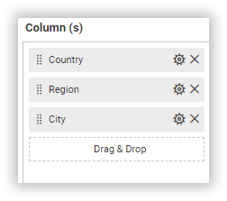
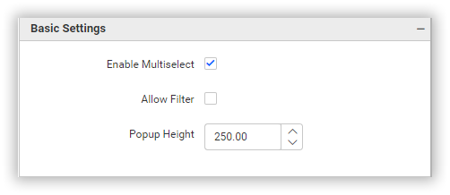

**MultipleDropDown**

The Multiple dropdown widget enables users to choose multiple options from a dropdown menu popup, offering a user-friendly solution for making selections from a list of choices without occupying excessive screen space.

**Data Binding**

You can bound the data to this widget as in the below image.

**Column(s)**

We have the option to include additional string columns in this section. For each string column added, a separate combo box will be generated.

**Properties**

Properties section allows for customization of the MultipleDropDown widget according to our requirements. The widget can be customized using the properties listed below.

**Basic Settings**

**Enable Multi Select** property help us to enable/disable the multiselect option in MultipleDropDown.

**Allow Filter** property help us to enable/disable the filter option in the popup of MultipleDropDown.

**Popup Height** property help us to customize the popup height in MultipleDropDown as per our requirement. 

