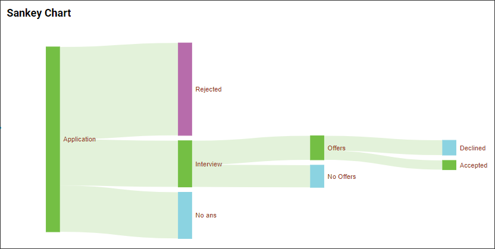
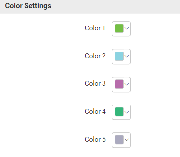

**Sankey Chart**

A Sankey chart is a type of flow diagram that illustrating the distribution of resources, the progression of a process, or the allocation of values within a system.

**Data Binding**

You have the ability to associate the data with the widget, just like shown in the image below.

**Value**

You have the ability to include the numerical values in this section.

**Column(s)**

In this section, you have the option to include both string and date values.

**Filter(s)**

The filters section assists in the filtration of data values that are sent to the widget.

**Properties**

The Properties section allows us to personalize the Sankey chart visualization according to our requirements. We possess the subsequent properties for customizing the Sankey Chart.

**Basic Settings**

**Enable Animation** property allows us to demonstrate the animation effect on the widget during the rendering process.

**Orientation** property assists in altering the control's orientation..

**Label Position** property assists in positioning the labels on the widget.

**Label Font Size** property allows for customization of the label font size according to our requirements.

**Label Color** property allows us to modify the color of the widget label.

**Link Color** property allows us to customize the color of the link line between the nodes.

**Auto Align Nodes** property allows us to enable or disable the automatic alignment of nodes in a widget.

**Color Settings**

By utilizing these properties, we are able to assign varying colors to the different levels of data items present in the widget.

