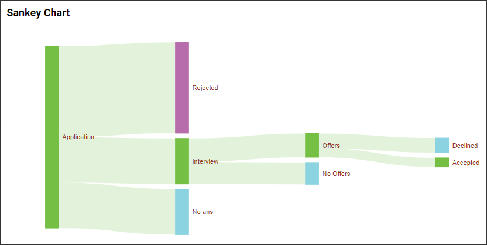
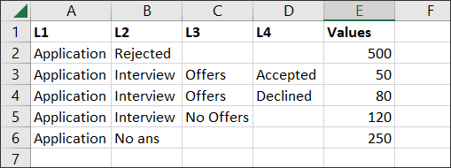

**Sankey Chart**

A Sankey chart is a type of flow diagram that illustrating the distribution of resources, the progression of a process, or the allocation of values within a system.

<kbd style="background-color: yellow;color:red;">**Note :** This product (Sankey Chart) is a sample and does not contain Syncfusion code. This is for illustrative purposes only and Syncfusion does not provide any warranty or indemnity. Use at your own risk and use professional skill and judgment.</kbd>

<blockquote style="background-color: #ff0000; padding: 10px; color: #ffffff;">
    <strong>Note:</strong> This is a highlighted note with a red background.
</blockquote>

**Use Case**

We demonstrate the interview process as an example and depict it in a sankey chart, similar to the image displayed below.

**Note :** It is possible to expand the sankey chart up to 6 levels, and this widget will not serve as a master widget. 

**Sample Data**

The sample data that we will display on the sankey chart can be found below.

