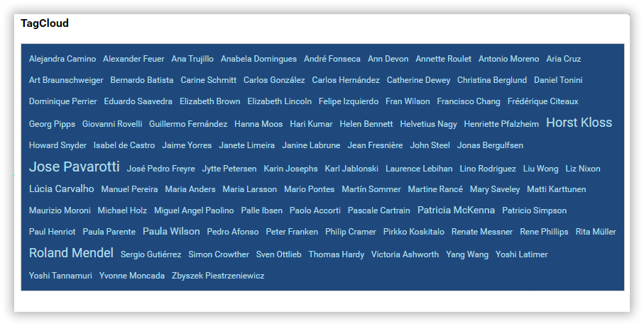
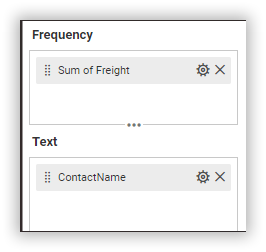
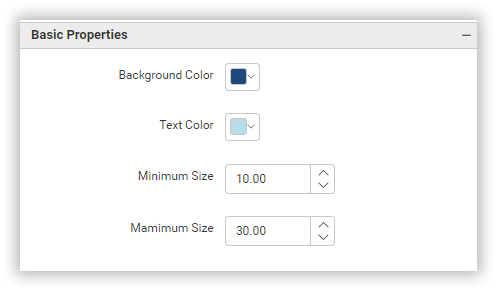

**TagCloud**

This is TagCloud to visualize the data as in the below image.

**Data Binding**

You can bound the data to the widget as in the below image.

**Frequency**

You can add the number values to this section.

**Text**

You can add the sting values to this section.

**Properties**

This Properties section helps us to customize the TagCloud visualization as per our need. We have the following properties to customize the TagCloud.

**Basic Properties**

**Background Color** property help us to set the background to the TagCloud container.

**Text Color**  property help us to set the font color to the text displayed on the TagCloud container.

**Maximum Size** property help us to set the maximum font size to the TagCloud.

**Minimum Size** property help us to set the minimum font size to the TagCloud.

