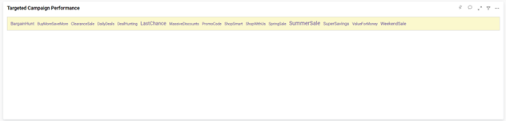
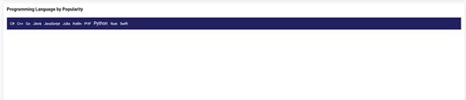
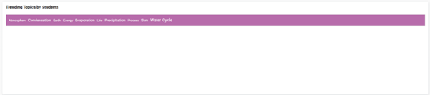

**TagCloud**

Empower decision-making through Tag Cloud visualizations. Track trends, assess performance, and optimize strategies for enhanced outcomes.

**Data Binding**

We have the ability to associate the data with the widget, as shown in the image below.

**Frequency**

We have the option to input numerical values into this section.

**Text**

We have the option to input string values into this section.

**Properties**

The Properties section allows for customization of the TagCloud visualization to meet specific requirements. The available properties in the TagCloud are as follows.

**Basic Properties**

**Background Color** Property enables us to define the background color of the TagCloud.

**Text Color**  property allows us to change the font color of the text shown on the TagCloud..

**Maximum Size** property allows us to establish the largest font size that can be used in the TagCloud.

**Minimum Size** property allows us to establish the smallest font size that can be used in the TagCloud.

**Use Cases**

**1. Targeted Marketing Campaign**

Visualize your campaign strategies by combining your marketing data with Tag Cloud widget, track targeted marketing campaigns and make informed marketing decisions.

**2. Visualize Best Rated Programming Languages**

Analyse developer’s data and track best rated performing programming languages using Tag Cloud Chart, track popularity of modern technologies and make prompt informed decisions. 

**3. Track Trending Topics in Academic**

Track the performance of various topics in different subjects using Tag Cloud widget and ensure effective teaching and delivery method.  

